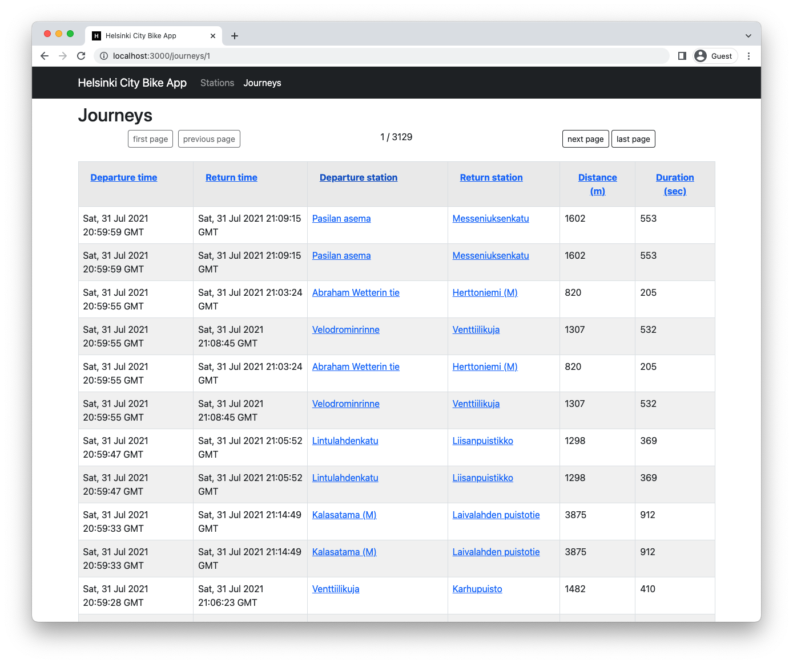

# Helsinki City Bike App - Backend
This is a pre-assignment for [Solita Academy](https://www.solita.fi/en/academy/) Autumn 2022. This project combines front- and backend applications for displaying data of journeys made with city bikes in the Helsinki Capital area.

## Fullstack application preview
Built demo version of the application is available at [helsinki-city-bike-app.cmd-mish.dev](https://helsinki-city-bike-app.cmd-mish.dev/). The journey dataset is limited to 2021-05.csv and contains around 800 000 entries. The app is running on my Raspberry Pi for the time being. 

### Station list view

### Journeys list view

### Single station view

## Instructions for project setup
Instructions on how to set up the backend of the application can be found [here](./backend/README.md)

The frontend of this application is a react app initialised with [Create React App](https://create-react-app.dev/). Instructions on how to build this part of the project can be found [from this file](./frontend/README.md#npm-run-build). However, before running the build, add a new parameter `homepage` to `package.json` file with a value that corresponds to the domain where the app will be published (e.g. `http://localhost/`).

## Tasklist
### Data import
- [x] Data import from .csv files
- [x] Data validation
- [x] No import for journeys under 10 s and 10 m 

### Journey list view
- [x] List journeys
- [x] Each journey should show: departure and return stations, covered distance in kilometers and duration in minutes
- [x] *(Optional)* Pagination
- [x] *(Optional)* Ordering per column
- [ ] *(Optional)* Searching
- [ ] *(Optional)* Filtering

### Station list view
- [x] List all stations
- [ ] *(Optional)* Pagination
- [x] *(Optional)* Searching

### Single station view
- [x] Name
- [x] Address
- [x] Number of journeys starting at the station
- [x] Number of journeys ending at the station
- [x] *(Optional)* Location on map
- [x] *(Optional)* Average distance of journeys starting at the station
- [x] *(Optional)* Average distance of journeys ending at the station
- [ ] *(Optional)* Top 5 most popular return stations
- [ ] *(Optional)* Top 5 most popular departure stations
- [ ] *(Optional)* Filtering calculations per month

