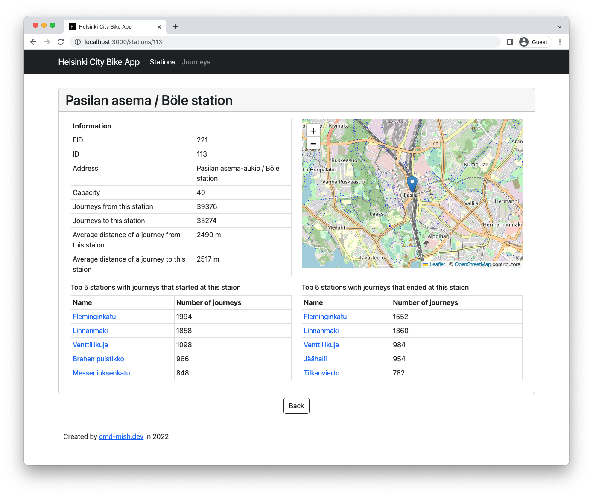

# Helsinki City Bike App - Backend
This is a pre-assignment for [Solita Academy](https://www.solita.fi/en/academy/) Autumn 2022. This project combines front- and back-end applications for displaying data of journeys made with city bikes in the Helsinki Capital area.

## Front-end Preview

### Station list view

### Journeys list view

### Single station view
